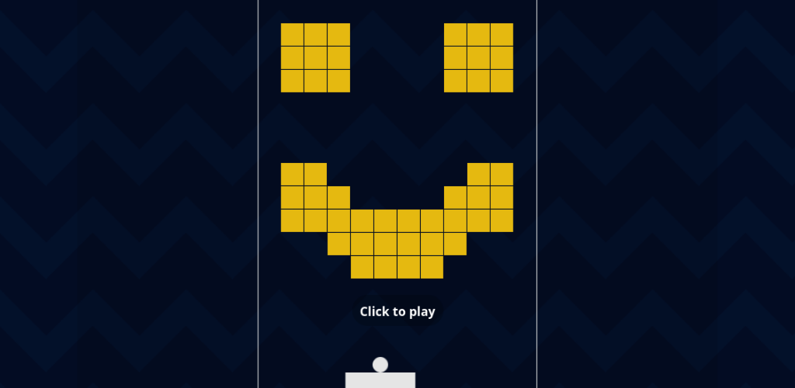

# Breakout 71

Break colourful bricks, catch bouncing coins and select powerful upgrades !

[Play now](https://breakout.lecaro.me/) - 
[Google Play](https://play.google.com/store/apps/details?id=me.lecaro.breakout) - 
[itch.io](https://renanlecaro.itch.io/breakout71) - 
[GitLab](https://gitlab.com/lecarore/breakout71) - 
[Donate](https://github.com/sponsors/renanlecaro)

## Gameplay

The goal is to catch as many coins as possible during 7 levels. Coins appear when you break bricks. They fly around, bounce and roll, and you need to catch them with your puck. Your "combo" is the number of coins spawned when a brick breaks, it is displayed on your puck. Your score is displayed in the top right corner of the screen, it is the number of coins you have managed to catch since the begining of your run. 

At the end of each level, you get to pick an upgrade from a random selection. Many upgrades impact your "combo". Upgrades apply to the whole run and can synergize. For example, "hot start" increases your combo greatly at the start of each level, but makes it tick down rapidly. If you combine it with "+1 ball", "piercing" and "bricks become bombs", you'll clear levels so fast that the combo will still be high when the fireworks are over and your puck will be showered by coins. 

What decides how the ball flies away is only the position of the puck hit. The puck speed and incoming angle have no impact. You must delete all bricks to progress to the next level, and never drop the ball. 

After clearing a level, you'll be able to pick upgrades among a small selection presented to you. They'll apply until the end of the run. A normal run lasts 7 levels, after which your score is recorded, and you can start again. Each run is different, the levels and upgrades you see will change every time, and new ones get added to the pool when you progress in the game.

The app should work offline and perform well even on low-end devices. It's very lean and does not take much storage space (Roughly 0.1MB). If the app stutters, turn on "fast mode" in the settings to render a simplified view that should be faster.

There's also an easy mode for kids (slower ball) and a color-blind mode (no color related game mechanics).

## Doing
- publish on Fdroid

## Perk ideas
- wrap left / right
- n% of the broken bricks respawn when the ball touches the puck
- bricks break 50% of the time but drop 50% more coins
- wind (puck positions adds force to coins and balls)
- balls repulse coins
- n% of coins missed respawn at the top
- lightning : missing triggers and explosive lighting strike around ball path
- coins repulse coins (could get really laggy)
- balls repulse coins
- balls attract coins
- twice as many coins after a wall bounce, twice as little otherwise ? 
- fusion reactor (gather coins in one spot to triple their value)
- missing makes you loose all score of level, but otherwise multiplier goes up after each breaking
- soft reset, cut combo in half instead of zero
- missile goes when you catch coin
- missile goes when you break a brick
- puck bounce +1 combo, hit nothing resets
- multiple hits on the same brick (show remaining resistance as number) 
- bricks attract ball
- replay last level (remove score, restores lives if any, and rebuild )
- accelerometer controls coins and balls
- bricks attract coins
- breaking bricks stains neighbours
- extra kick after bouncing on puck
- transparent coins
- coins of different colors repulse
- bricks follow game of life pattern with one update every second 
- 2x coins when ball goes downward / upward, half that amount otherwise ?
- new ball spawns when reaching combo X
- missing with combo triggers explosive lightning strike
- correction : pick one past upgrade to remove and replace by something else 
- puck bounce predictions rendered with particles or lines (requires big refactor)

## Engine ideas
- few puck bounces = more choices / upgrades
- disable zooming (for ios double tap)
- particles when bouncing on sides / top
- show total score on end screen (score added to total) 
- show stats on end screen compared to other runs
- handle back bouton in menu 
- mouvement relatif du puck
- balls should collide with each other
- when game resumes near bottom, be unvulnerable for .5s ? , once per level
- apply global curve / brightness to canvas when things blow, or just always to make neon effect better
- manifest for PWA (android and apple)  
- lights shadows  
- keyboard support
- Offline mode web for iphone 
- controller support on web/mobile
- webgl rendering
- enable export of gameplay capture in webview

## Level ides

- famous games
- letters
- fruits
- animals

## Credits

I pulled many background patterns from https://pattern.monster/
They are displayed in [patterns.html](patterns.html) for easy inclusion.

Some of the sound generating code was written by ChatGPT, and heavily
adapted to my usage over time.

Some of the pixel art is taken from google image search results, I hope to replace it by my own over time : 
[Heart](https://www.youtube.com/watch?v=gdWiTfzXb1g)  
[Mushroom](https://pixelartmaker.com/art/cce4295a92035ea)
 

I wanted an APK to start in fullscreen and be able to list it on fdroid and the play store. I started with an empty view and went to work trimming it down, with the help of that tutorial 
https://github.com/fractalwrench/ApkGolf/blob/master/blog/BLOG_POST.md
